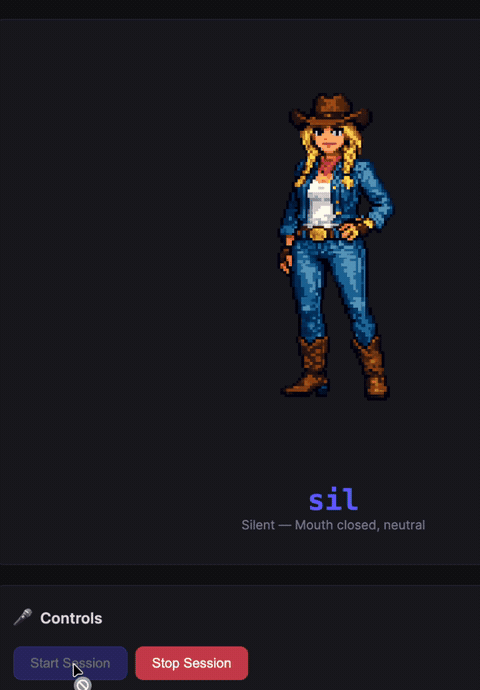

# @beer-digital/lipsync-engine

Production-grade, renderer-agnostic streaming lip-sync engine for browser-based 2D animation. Real-time viseme detection from streaming audio via AudioWorklet + Web Audio API.

**Zero dependencies. ~15KB minified. Works with any 2D rendering approach.**

<p align="center">
  
</p>

> *Pixel art cowgirl talking via OpenAI Realtime API with real-time lip sync — [try the demo](#demos)*

## Why This Exists

Existing lip-sync solutions are either C++ desktop tools (Rhubarb), tied to 3D avatars (TalkingHead), or require paid cloud APIs (Azure, ElevenLabs viseme endpoints). This library fills the gap: a lightweight, browser-native engine that takes streaming audio in and emits viseme events out — bring your own renderer.

## Quick Start

```bash
npm install @beer-digital/lipsync-engine
```

### Minimal Example: OpenAI Realtime API + SVG Mouth

```javascript
import { LipSyncEngine, SVGMouthRenderer, base64ToInt16 } from '@beer-digital/lipsync-engine';

// 1. Create engine
const engine = new LipSyncEngine({
  sampleRate: 24000,
  workletUrl: '/streaming-processor.js', // Copy from dist/worklet/
});

// 2. Create SVG mouth renderer (no sprite sheet needed)
const mouth = new SVGMouthRenderer(document.getElementById('avatar-mouth'), {
  width: 120,
  height: 80,
  lipColor: '#cc4444',
  showTeeth: true,
});

// 3. Initialize (must be after user gesture)
await engine.init();

// 4. Wire up viseme events to renderer
engine.on('viseme', (frame) => mouth.render(frame));
engine.startAnalysis();

// 5. Feed audio from OpenAI Realtime API
const ws = new WebSocket('wss://api.openai.com/v1/realtime?model=gpt-realtime', ...);
ws.onmessage = (event) => {
  const data = JSON.parse(event.data);
  if (data.type === 'response.output_audio.delta') {
    engine.feedAudio(base64ToInt16(data.delta));
  }
};
```

### Microphone Input

```javascript
const engine = new LipSyncEngine();
await engine.init();

const stream = await navigator.mediaDevices.getUserMedia({ audio: true });
engine.attachStream(stream); // Analyzes without playing back (no feedback)

engine.on('viseme', (frame) => {
  console.log(frame.viseme, frame.intensity, frame.shape);
});

engine.startAnalysis();
```

### Audio Element

```javascript
const engine = new LipSyncEngine();
await engine.init();

const audio = document.querySelector('audio');
engine.attachElement(audio);
engine.startAnalysis();

engine.on('viseme', (frame) => {
  myCharacter.setMouth(frame.simpleViseme); // 'A' through 'F'
});

audio.play();
```

## Architecture

```
┌──────────────────────────────────────────────────────────────────┐
│                        LipSyncEngine                              │
│                                                                    │
│  ┌─────────────┐    ┌──────────────┐    ┌───────────────────┐    │
│  │ Audio Input  │───▶│  AudioWorklet │───▶│   AnalyserNode    │    │
│  │  - PCM feed  │    │  Ring buffer  │    │   FFT analysis    │    │
│  │  - MediaStr  │    │  Gapless play │    │   Band energies   │    │
│  │  - Element   │    │  Position rpt │    │                   │    │
│  └─────────────┘    └──────────────┘    └────────┬──────────┘    │
│                                                    │               │
│                                          ┌────────▼──────────┐   │
│                                          │ FrequencyAnalyzer  │   │
│                                          │  Viseme detection  │   │
│                                          │  Smoothing/holdoff │   │
│                                          │  Shape interp.     │   │
│                                          └────────┬──────────┘   │
│                                                    │               │
│                                          emit('viseme', frame)    │
└──────────────────────────────────────────┬───────────────────────┘
                                           │
                            ┌──────────────┼──────────────┐
                            │              │              │
                   ┌────────▼───┐  ┌───────▼────┐ ┌──────▼──────┐
                   │SVGMouth    │  │Canvas      │ │CSSClass     │
                   │Renderer    │  │Renderer    │ │Renderer     │
                   │(Procedural)│  │(Sprites)   │ │(CSS classes)│
                   └────────────┘  └────────────┘ └─────────────┘
```

## Viseme Sets

### Extended (15 shapes — Oculus/MPEG-4 compatible)

| Key | Phonemes  | Description              | Mouth Shape              |
|-----|-----------|--------------------------|--------------------------|
| sil | (silence) | Mouth closed             | open: 0, width: 0.5      |
| PP  | P, B, M   | Lips pressed together    | open: 0, width: 0.4      |
| FF  | F, V      | Lower lip to upper teeth | open: 0.05, width: 0.55  |
| TH  | TH        | Tongue between teeth     | open: 0.1, width: 0.5    |
| DD  | D, T, N, L| Tongue to upper palate   | open: 0.2, width: 0.5    |
| kk  | K, G      | Back of tongue raised    | open: 0.25, width: 0.45  |
| CH  | CH, SH, J | Lips pursed forward      | open: 0.15, round: 0.6   |
| SS  | S, Z      | Teeth close, slight smile| open: 0.05, width: 0.6   |
| nn  | N, NG     | Mouth slightly open      | open: 0.15, width: 0.5   |
| RR  | R         | Lips slightly rounded    | open: 0.2, round: 0.4    |
| aa  | AA, AH    | Wide open mouth          | open: 0.9, width: 0.6    |
| E   | EH, AE    | Mouth open, slight smile | open: 0.5, width: 0.65   |
| I   | IH, IY    | Small opening, smile     | open: 0.25, width: 0.7   |
| O   | OH, AO    | Rounded, medium open     | open: 0.6, round: 0.8    |
| U   | UW, OW    | Small rounded opening    | open: 0.2, round: 0.9    |

### Simple (6 shapes — Preston Blair / Hanna-Barbera)

| Key | Maps to  | Use for           |
|-----|----------|-------------------|
| A   | sil      | Rest / closed     |
| B   | PP, nn   | M, B, P sounds    |
| C   | E, I, SS | EE, soft sounds   |
| D   | aa, DD   | AH, wide open     |
| E   | O, RR, CH| OH, round sounds  |
| F   | FF, TH, U| OO, F/V, tight    |

## Renderers

### SVGMouthRenderer (Procedural)

No sprite sheet needed — generates an animated SVG mouth driven by `{open, width, round}` shape parameters.

```javascript
import { SVGMouthRenderer } from '@beer-digital/lipsync-engine';

const mouth = new SVGMouthRenderer(container, {
  width: 120,
  height: 80,
  lipColor: '#cc4444',
  innerColor: '#3a1111',
  teethColor: '#fff',
  showTeeth: true,
  lipThickness: 3,
});

engine.on('viseme', (frame) => mouth.render(frame));
```

### CanvasRenderer (Sprite Sheet)

Draw mouth frames from a sprite sheet image.

```javascript
import { CanvasRenderer } from '@beer-digital/lipsync-engine';

const renderer = new CanvasRenderer(canvas, {
  spriteSheet: 'mouth-sprites.png',
  frameWidth: 128,
  frameHeight: 128,
  visemeMap: { sil: 0, PP: 1, FF: 2, aa: 3, E: 4, O: 5 },
  columns: 4,
});

engine.on('viseme', (frame) => renderer.render(frame));
```

### CSSClassRenderer (CSS-driven)

Sets data attributes and CSS classes on any element. Great for CSS animations, Lottie, or framework components.

```javascript
import { CSSClassRenderer } from '@beer-digital/lipsync-engine';

const renderer = new CSSClassRenderer(avatarElement, {
  attribute: 'data-viseme',
  classPrefix: 'mouth-',
  useSimpleVisemes: true, // Uses A-F
  setIntensity: true,     // Sets CSS custom properties
});

// In CSS:
// .mouth-A { background-position: 0 0; }
// .mouth-D { background-position: -128px 0; }
// Transform with: transform: scaleY(var(--lip-open));
```

### Custom Renderer

Just listen for viseme events and render however you want:

```javascript
engine.on('viseme', (frame) => {
  // frame.viseme       → 'aa', 'PP', 'sil', etc.
  // frame.simpleViseme → 'A' through 'F'
  // frame.intensity    → 0..1 speech intensity
  // frame.shape.open   → 0..1 mouth openness
  // frame.shape.width  → 0..1 mouth width
  // frame.shape.round  → 0..1 lip roundness
  // frame.confidence   → 0..1 classification confidence
  // frame.bands        → { sub, low, mid, high, veryHigh }
  // frame.transition   → { from, to, progress }
  // frame.timeMs       → Playback position in ms

  myLottieAnimation.goToFrame(visemeToFrame[frame.viseme]);
  // or
  myPixiSprite.texture = textures[frame.simpleViseme];
  // or
  myThreeJSMesh.morphTargetInfluences[0] = frame.shape.open;
});
```

## API Reference

### `LipSyncEngine`

#### Constructor Options

```javascript
new LipSyncEngine({
  sampleRate: 24000,           // Expected input sample rate
  fftSize: 256,                // FFT window size (power of 2)
  analyserSmoothing: 0.5,      // AnalyserNode smoothingTimeConstant
  silenceThreshold: 0.015,     // RMS below this = silence
  smoothingFactor: 0.35,       // Viseme transition smoothing (0–1)
  holdFrames: 2,               // Min frames before viseme switch
  volume: 1.0,                 // Playback volume
  startThresholdMs: 50,        // Buffer ms before auto-play
  bufferSeconds: 5,            // Ring buffer capacity
  analysisMode: 'raf',         // 'raf' or 'interval'
  analysisIntervalMs: 16,      // For interval mode
  workletUrl: null,            // Custom worklet URL
  disablePlayback: false,      // Analyze only, no audio output
});
```

#### Methods

| Method | Description |
|--------|-------------|
| `init(ctx?)` | Initialize audio pipeline (async, needs user gesture) |
| `feedAudio(samples, rate?)` | Feed Int16Array, Float32Array, or ArrayBuffer |
| `attachStream(stream)` | Attach MediaStream (mic, WebRTC) |
| `attachElement(el)` | Attach audio/video element |
| `startAnalysis()` | Start viseme detection loop |
| `stopAnalysis()` | Stop analysis |
| `setVolume(0–1)` | Set playback volume |
| `clearBuffer()` | Clear audio buffer |
| `play()` / `pause()` | Control playback |
| `reset()` | Reset all state |
| `getState()` | Get current state snapshot |
| `destroy()` | Release all resources |

#### Events

| Event | Data | Description |
|-------|------|-------------|
| `viseme` | `VisemeFrame` | Emitted every analysis frame |
| `position` | `{timeMs, bufferLevel, bufferMs, isPlaying}` | Playback position |
| `playbackStarted` | — | Audio playback began |
| `playbackEnded` | — | Fade-out complete |
| `bufferUnderrun` | `{timeMs}` | Buffer empty |
| `initialized` | — | Engine ready |
| `destroyed` | — | Engine torn down |

### Utility Functions

```javascript
import {
  base64ToInt16,   // Decode base64 PCM (for TTS WebSocket APIs)
  int16ToBase64,   // Encode PCM to base64
  int16ToFloat32,  // Convert Int16 → Float32
  float32ToInt16,  // Convert Float32 → Int16
  calculateRMS,    // Root Mean Square amplitude
  resample,        // Resample between sample rates
  interpolateShapes, // Blend between viseme mouth shapes
} from '@beer-digital/lipsync-engine';
```

## Integration Examples

### ElevenLabs WebSocket

```javascript
const ws = new WebSocket('wss://api.elevenlabs.io/v1/text-to-speech/...');

ws.onmessage = (event) => {
  const data = JSON.parse(event.data);
  if (data.audio) {
    engine.feedAudio(base64ToInt16(data.audio));
  }
};
```

### Web Speech API (SpeechSynthesis)

```javascript
const utterance = new SpeechSynthesisUtterance('Hello world');
const dest = engine.audioContext.createMediaStreamDestination();
// Note: Web Speech API doesn't provide raw audio access in most browsers.
// Use a TTS API with audio output for best results.
```

### WebRTC (Remote Speaker)

```javascript
peerConnection.ontrack = (event) => {
  engine.attachStream(event.streams[0]);
  engine.startAnalysis();
};
```

## Demos

### Interactive Demo (no API key needed)

Test with microphone, audio files, or a synthetic waveform:

```bash
npm install
npm run dev
# Opens http://localhost:3000
```

### OpenAI Realtime Voice Demo

Full voice conversation with real-time lip sync on a pixel art avatar:

```bash
npm install
OPENAI_API_KEY=sk-... npm run demo:realtime
# Opens http://localhost:3000/demo/realtime.html
```

Speak into your mic — the AI responds with voice and the avatar's mouth animates in real time. Uses a lightweight WebSocket proxy (`server.js`) to keep your API key server-side.

## Development

```bash
npm install
npm run dev          # Interactive demo
npm run build        # Build for distribution
npm run test         # Run tests
npm run lint         # Lint source
```

### Project Structure

```
lipsync-engine/
├── src/
│   ├── index.js                    # Main entry + exports
│   ├── types.d.ts                  # TypeScript definitions
│   ├── core/
│   │   ├── LipSyncEngine.js        # Main orchestrator
│   │   └── visemes.js              # Viseme constants + mappings
│   ├── analyzers/
│   │   └── FrequencyAnalyzer.js    # Real-time viseme detection
│   ├── renderers/
│   │   ├── SVGMouthRenderer.js     # Procedural SVG mouth
│   │   ├── CanvasRenderer.js       # Sprite sheet renderer
│   │   └── CSSClassRenderer.js     # CSS class toggler
│   ├── utils/
│   │   ├── EventEmitter.js         # Typed event system
│   │   ├── RingBuffer.js           # Lock-free ring buffer
│   │   └── audio-utils.js          # PCM conversion + DSP
│   └── worklets/
│       └── streaming-processor.js  # AudioWorklet (standalone)
├── demo/
│   ├── index.html                  # Interactive demo (mic/file/synth)
│   ├── realtime.html               # OpenAI Realtime voice demo
│   └── avatar.png                  # Pixel art avatar
├── server.js                       # WebSocket proxy for Realtime API
├── package.json
├── vite.config.js
└── README.md
```

## Browser Support

| Browser | Minimum Version | Notes |
|---------|----------------|-------|
| Chrome  | 66+ | Full support |
| Firefox | 76+ | Full support |
| Safari  | 14.1+ | AudioWorklet support |
| Edge    | 79+ | Chromium-based |

## Important Notes

### AudioWorklet File Serving

The `streaming-processor.js` worklet file must be served from the same origin as your page (or with appropriate CORS headers). Copy it to your public assets:

```bash
cp node_modules/@beer-digital/lipsync-engine/dist/worklet/streaming-processor.js public/
```

Then reference it:

```javascript
const engine = new LipSyncEngine({
  workletUrl: '/streaming-processor.js',
});
```

### User Gesture Requirement

Browsers require a user gesture before creating an AudioContext. Always call `engine.init()` inside a click/touch handler.

### COOP/COEP Headers (Optional)

For SharedArrayBuffer support (not required but improves performance):

```
Cross-Origin-Opener-Policy: same-origin
Cross-Origin-Embedder-Policy: require-corp
```

## License

MIT — Beer Digital LLC
